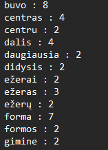

# Egzamino užduotis

## Apie programą

- Programa nuskaito tekstą esantį `text.txt` faile. 
- Kiekvienas žodis yra suvienodinamas - paverčiamas mažosiomis raidėmis, o skyrybos ženklai pašalinami.
- Žodžiai suskaičiuojami
- Žodžiai kurie pasikartoja 2 ar daugiau kartų yra išvedami į `zodziai1.txt` failą, o į `cross-reference2.txt` failą yra išvedamas žodis ir eilutės kuriose jis yra. Iš teksto taip pat išrenkami ir URL'ai ir talpinami `url.txt` faile.

Programa veikia ir su lietuviškomis raidėmis.

## Programos paleidimas
1. Sukompiliuokite programą `g++ main.cpp funkcijos.cpp -o programa`
2. Paleiskite programą `./programa`
